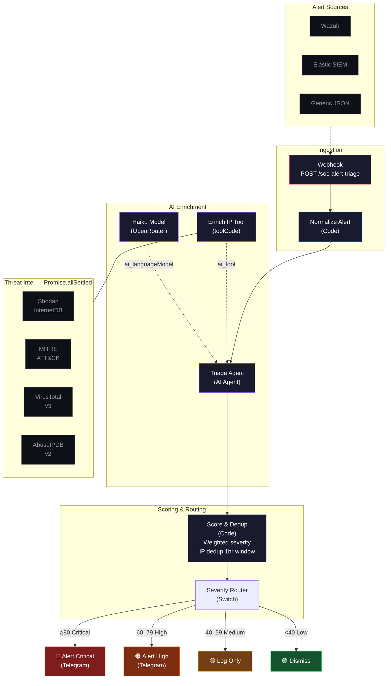

# SOC Alert Triage

AI-powered Security Operations Center alert triage with parallel threat intelligence enrichment.

Ingests alerts from SIEM (Wazuh, Elastic, Splunk), enriches with threat intel (VirusTotal, AbuseIPDB, Shodan, MITRE ATT&CK mapping), scores severity, deduplicates into incidents, and routes to response actions — all built as a single n8n workflow using code-mode parallel execution.

## Architecture



**9 nodes** | Built with [n8nac](https://github.com/mj-deving/n8n-autopilot) (code-first n8n)

## Benchmark: Code-Mode vs Traditional

Traditional n8n AI agents make 7+ sequential tool calls per alert — each call replays the full conversation history, causing **O(n^2) token growth**. This workflow fires all enrichment in parallel inside a single `Promise.allSettled`, keeping token usage **O(1)**.

| Metric | Traditional (7 tool calls) | Code-Mode (1 tool call) | Savings |
|---|---|---|---|
| **LLM calls per alert** | 7 | 2 | **71% fewer** |
| **Tokens per alert** | ~10,280 | 1,423 | **86% fewer** |
| **Enrichment latency** | ~1,250ms (sequential) | 245ms (parallel) | **5x faster** |
| **End-to-end execution** | ~23s | ~7s | **3.3x faster** |
| **Annual LLM cost** (500 alerts/day) | $1,857 | $560 | **$1,297/year saved** |
| **n8n nodes** | ~15 | 9 | **40% fewer** |

> Measured on 3 real executions using Claude Haiku 4.5 via OpenRouter. Token counts from n8n execution metadata. Traditional approach modeled analytically — the O(n^2) growth is inherent to ReAct agent patterns where each tool result accumulates in the prompt. Full methodology in [`benchmark.md`](benchmark.md).

### Why the savings are structural

Each traditional tool call replays **all prior results** in the prompt. After VirusTotal returns 500 tokens of JSON, every subsequent call (AbuseIPDB, Shodan, MITRE, scoring, dedup, formatting) includes those 500 tokens again. By call 7, the prompt contains the system message + alert + 6 API responses + 6 decisions.

Code-mode sidesteps this entirely: enrichment runs in JavaScript (zero LLM tokens), and the LLM sees the combined result **exactly once**. Adding a 5th or 6th API source adds ~100ms of parallel HTTP time and zero additional LLM overhead.

## Verified Test Results

| Test IP | Type | Score | Level | Route | Shodan | MITRE |
|---|---|---|---|---|---|---|
| `185.220.101.34` | Tor exit node | 73 | High | Telegram | `tor-exit-34.for-privacy.net`, ports 80/10134 | T1110 Brute Force |
| `8.8.8.8` | Google DNS | 23 | Low | Dismiss | `dns.google`, ports 53/443 | No match |

Scoring breakdown for the Tor exit node: Shodan=40 (ports + Tor hostname) + base=75 (high severity alert), redistributed to 50/50 weight since VT/AbuseIPDB unavailable, plus MITRE boost +15 = **73/100**.

## Setup

### Prerequisites

- n8n instance (self-hosted or cloud)
- Node.js 18+
- [n8nac](https://github.com/mj-deving/n8n-autopilot) (`npm install` handles this)

### Quick Start

```bash
# 1. Clone and install
git clone https://github.com/mj-deving/soc-alert-triage.git
cd soc-alert-triage
npm install

# 2. Connect to your n8n instance
export N8N_API_KEY="<your n8n API key>"
npm run setup:n8n -- http://<your-n8n-host>:5678

# 3. Push and activate the workflow
npx --yes n8nac list --local        # confirm the .workflow.ts file is found
npx --yes n8nac push "<path-from-list>"
npx --yes n8nac workflow activate <workflow-id>

# 4. Test with a sample alert
curl -X POST http://<your-n8n-host>:5678/webhook/soc-alert-triage \
  -H "Content-Type: application/json" \
  -d '{"rule":{"id":"5710","level":10,"description":"SSH brute force attack"},"agent":{"name":"webserver-01","ip":"10.0.1.50"},"data":{"srcip":"185.220.101.34","dstip":"10.0.1.50","dstport":"22"},"timestamp":"2026-04-16T10:30:00Z"}'
```

## Credentials

| Credential | Type | Used By | Required |
|---|---|---|---|
| OpenRouter | `openAiApi` | Haiku Model (LLM) | Yes |
| Telegram Bot | `telegramApi` | Alert Critical / Alert High | Yes (for notifications) |
| VirusTotal | header (`x-apikey`) | Enrich IP Tool | Optional — degrades gracefully |
| AbuseIPDB | header (`Key`) | Enrich IP Tool | Optional — degrades gracefully |

The workflow runs end-to-end without VirusTotal or AbuseIPDB keys. When unavailable, their scoring weight redistributes to Shodan and base severity.

### Configuring Telegram

1. Get your chat ID from `@get_id_bot` on Telegram
2. In the n8n UI, open any Code node in the workflow and execute:

```javascript
const staticData = $getWorkflowStaticData('global');
staticData.telegram_chat_id = 'YOUR_CHAT_ID';
return [{ json: { done: true } }];
```

## Enrichment Sources

| Source | Endpoint | Auth | Free Tier | Returns |
|---|---|---|---|---|
| Shodan InternetDB | `internetdb.shodan.io/{ip}` | None | Unlimited | Ports, hostnames, vulns, CPEs |
| MITRE ATT&CK | Embedded mapping | None | Unlimited | Technique ID, name, tactic |
| VirusTotal v3 | `virustotal.com/api/v3/ip_addresses/{ip}` | API key | 500 req/day | Reputation, analysis stats, country |
| AbuseIPDB v2 | `api.abuseipdb.com/api/v2/check` | API key | 1,000 req/day | Abuse score, reports, is_tor, ISP |

### MITRE ATT&CK Mappings

The enrichment tool includes 12 keyword-based technique mappings:

| Alert Keywords | Technique | Tactic |
|---|---|---|
| brute force, failed login | T1110 Brute Force | Credential Access |
| ssh | T1021.004 Remote Services: SSH | Lateral Movement |
| rdp, remote desktop | T1021.001 Remote Services: RDP | Lateral Movement |
| port scan, network scan | T1046 Network Service Discovery | Discovery |
| malware, trojan, ransomware | T1204 User Execution | Execution |
| phishing | T1566 Phishing | Initial Access |
| privilege, escalat, sudo | T1068 Exploitation for Priv Esc | Privilege Escalation |
| exfiltrat, data transfer | T1041 Exfiltration Over C2 | Exfiltration |
| c2, beacon, callback | T1071 Application Layer Protocol | Command and Control |
| sql injection | T1190 Exploit Public-Facing App | Initial Access |
| web shell | T1505.003 Web Shell | Persistence |
| dos, ddos, flood | T1498 Network DoS | Impact |

## Scoring Algorithm

Weighted severity with dynamic redistribution:

| Factor | Weight | Range | Calculation |
|---|---|---|---|
| VirusTotal | 0.3 | 0-100 | max(malicious_ratio, abs(reputation)) |
| AbuseIPDB | 0.3 | 0-100 | abuse_confidence_score |
| Shodan | 0.2 | 0-100 | ports x 10 + vulns x 20 + tor_indicator x 20 |
| Base severity | 0.2 | 25-100 | critical=100, high=75, medium=50, low=25 |
| MITRE boost | +15 flat | 0 or 15 | Added when technique ID matched |

When a source is unavailable, its weight redistributes proportionally to the remaining sources. Final score is capped at 100.

### Severity Routing

| Score | Level | Action |
|---|---|---|
| >= 80 | Critical | Telegram alert with red badge |
| 60-79 | High | Telegram alert with orange badge |
| 40-59 | Medium | Log only |
| < 40 | Low | Dismiss |

## Supported Alert Formats

| Format | Detection Logic | Key Fields |
|---|---|---|
| Wazuh | `rule` + `agent` + `data` present | `data.srcip`, `data.dstip`, `rule.description`, `rule.level` |
| Elastic SIEM | `signal.rule` present | `source.ip`, `destination.ip`, `signal.rule.name` |
| Generic | Fallback | `source_ip`, `dest_ip`, `alert_type`, `severity` |

## Test Payloads

### Wazuh (SSH Brute Force from Tor Exit Node)

```bash
curl -X POST http://<n8n-host>:5678/webhook/soc-alert-triage \
  -H "Content-Type: application/json" \
  -d '{
    "rule": {"id": "5710", "level": 10, "description": "SSH brute force attack"},
    "agent": {"name": "webserver-01", "ip": "10.0.1.50"},
    "data": {"srcip": "185.220.101.34", "dstip": "10.0.1.50", "dstport": "22"},
    "timestamp": "2026-04-16T10:30:00Z"
  }'
```

Expected: score ~73, severity HIGH, Telegram notification triggered.

### Generic (Low Severity)

```bash
curl -X POST http://<n8n-host>:5678/webhook/soc-alert-triage \
  -H "Content-Type: application/json" \
  -d '{
    "rule": {"id": "1002", "level": 3, "description": "DNS query to external resolver"},
    "agent": {"name": "workstation-05", "ip": "10.0.2.10"},
    "data": {"srcip": "8.8.8.8", "dstip": "10.0.2.10", "dstport": "53"},
    "timestamp": "2026-04-16T14:15:00Z"
  }'
```

Expected: score ~23, severity LOW, no notification.

## Deduplication

Tracks source IPs in a 1-hour rolling window via `$getWorkflowStaticData('global')`. Duplicate alerts are flagged (`is_duplicate: true`) but still processed through the full pipeline. The dedup count and first-seen timestamp are included in Telegram notifications.

## n8n Sandbox Constraints

All enrichment code runs in n8n's restricted V8 sandbox:

- No `require()` — no filesystem, no native modules
- No `fetch()` — only `this.helpers.httpRequest()` for HTTP
- `Promise.allSettled()` works for parallel execution
- `$getWorkflowStaticData('global')` for cross-execution persistence
- `toolCode` `inputSchema` must be a JSON **string**, not a JS object

## License

MIT
