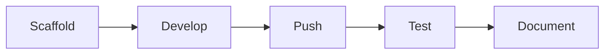

# My n8n Project


**Code-first n8n workflows with [n8nac](https://github.com/mj-deving/n8n-autopilot) and [code-mode](https://github.com/universal-tool-calling-protocol/code-mode).**

## Quick Start

```bash
# 1. Clone this template
git clone https://github.com/YOUR-USER/YOUR-PROJECT.git
cd YOUR-PROJECT

# 2. Install dependencies
npm install

# 3. Initialize Beads if this repo copy does not already include .beads
bd init -p "$(basename "$(pwd)")"

# 4. Connect to your n8n instance
export N8N_API_KEY="<your n8n API key>"
npm run setup:n8n -- http://<your-n8n-host>:5678

# 5. Enable pre-commit secret detection
git config core.hooksPath .githooks

# 6. Scaffold your first workflow
npm run new-workflow -- agents/01-my-agent "My First Agent"

# 7. Validate locally, then build, push, test
npm run validate:workflows
npx --yes n8nac push my-first-agent.workflow.ts
```

## What's Included

| Directory | Purpose |
|---|---|
| `workflows/` | Your workflow directories (scaffolded by `new-workflow.sh`) |
| `workflow/` | Root-level workflow export for standalone distribution |
| `template/` | Scaffold source files for new workflows |
| `scripts/` | bootstrap, scaffold, secret-check, and local validation helpers |
| `assets/` | Screenshots, diagrams, and visual assets |
| `docs/` | GitHub Pages site + Architecture Decision Records |
| `.beads/` | [Beads](https://github.com/steveyegge/beads) AI-native issue tracker |
| `.githooks/` | Pre-commit secret detection |
| `.github/` | Issue templates, funding config, Pages CI |

## Workflow Lifecycle



1. **Scaffold** a new workflow directory with `npm run new-workflow`
2. **Develop** in n8n UI or write `.workflow.ts` directly
3. **Validate locally** with `npm run validate:workflows`
4. **Push** to n8n with `npx --yes n8nac push <filename>.workflow.ts`
5. **Test** with `npx --yes n8nac test <id> --prod`
6. **Document** the README and test payloads

## Commands

```bash
# Scaffold a new workflow
npm run new-workflow -- agents/01-my-agent "My Agent Name"

# Bootstrap n8nac non-interactively
export N8N_API_KEY="<your n8n API key>"
npm run setup:n8n -- http://<your-n8n-host>:5678

# Check for accidentally committed secrets
npm run check-secrets

# Validate root workflow JSON
npm run validate

# Validate all scaffolded workflow.ts files without live credentials
npm run validate:workflows

# n8nac workflow operations
npx --yes n8nac list                    # List all workflows
npx --yes n8nac pull <id>              # Pull from n8n
npx --yes n8nac push <file>.workflow.ts # Push to n8n
npx --yes n8nac verify <id>            # Validate live workflow
npx --yes n8nac test <id> --prod       # Test webhook workflows

# Beads issue tracking
bd ready              # Find available work
bd create "Title"     # Create an issue
bd close <id>         # Complete work
bd sync               # Sync with git
```

## Workflow Structure

Each scaffolded workflow gets:

```
workflows/<category>/<slug>/
├── README.md           # Overview, flow diagram, test instructions
├── workflow/
│   ├── workflow.ts     # n8nac TypeScript source
│   └── workflow.json   # n8n JSON export (for UI import)
├── test.json           # Test payloads
```

For standalone distribution, the root `workflow/workflow.json` contains a single exportable workflow.

## Categories

| Category | What Goes Here |
|---|---|
| `agents` | AI agent workflows (LLM-driven, tool-calling) |
| `pipelines` | Data processing pipelines (ETL, enrichment) |
| `triggers` | Event-driven automations (webhook, schedule, RSS) |
| `utilities` | Helper workflows (health checks, monitoring) |

## Setup

### Pre-commit Hook

Enable the secrets check hook:

```bash
git config core.hooksPath .githooks
```

### GitHub Pages

The `docs/` directory is auto-deployed to GitHub Pages on push. Enable Pages in your repo settings:

```bash
# Via GitHub CLI
gh api repos/{owner}/{repo}/pages -X POST -f build_type=workflow
```

Then edit `docs/index.html` with your project details.

### AI Agent Support

All three agent instruction files are committed and work natively — no manual setup needed:

- **`CLAUDE.md`** — Auto-read by Claude Code at startup. References both files below.
- **`@AGENTS.md`** — Auto-read by Codex. Beads workflow, session protocol, "Landing the Plane".
- **`AGENTS.md`** — Stub until you run `npm run setup:n8n -- <host>` or `npx --yes n8nac init`, which generates the full n8nac protocol.

### Beads Issue Tracking

This template includes [Beads](https://github.com/steveyegge/beads) (`bd`) for AI-native issue tracking:

```bash
bd onboard    # Get started if the repo already contains .beads
bd init -p "$(basename "$(pwd)")"  # run this first if your generated repo does not
bd ready      # Find available work
bd sync       # Sync issues with git
```

### Non-interactive n8nac setup

The `n8nac` CLI needs an API key even for initial instance setup. The template now provides a thin wrapper:

```bash
export N8N_API_KEY="<your n8n API key>"
npm run setup:n8n -- http://<your-n8n-host>:5678
```

This runs:

```bash
npx --yes n8nac init \
  --host http://<your-n8n-host>:5678 \
  --sync-folder "$(pwd)" \
  --instance-name local \
  --yes
```

### Credential-free validation

Before pushing to a live n8n instance, validate local workflow sources:

```bash
npm run validate:workflows
```

This uses `npx --yes n8nac skills validate` against every `workflow.ts` file under `workflows/`.

## Documentation

- [GitHub Pages Site](https://YOUR-USER.github.io/YOUR-PROJECT/) — project overview with Mermaid diagrams
- [Architecture Decision Records](docs/decisions/) — documented design choices

## License

MIT
