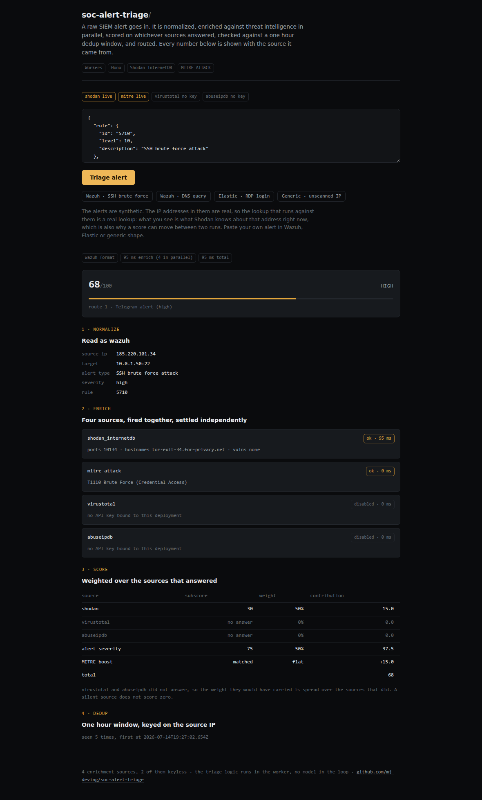

# soc-alert-triage

A SIEM alert goes in raw, and comes out normalized, enriched against threat intelligence, scored on whichever sources answered, and routed. It runs on a Worker, and the two enrichers the demo runs on need no API key.

**Live:** <https://soc-alert-triage.mariusdeving.workers.dev> · **Stack:** Workers · Hono · Shodan InternetDB · MITRE ATT&CK



## What it does

Four stages, and the console shows each of them at work. **Normalize** reads the alert's shape to work out which SIEM emitted it (Wazuh carries `rule` + `agent` + `data`, Elastic carries `signal.rule`, anything else is read field by field) and flattens it to one schema. **Enrich** fires four threat-intelligence lookups at once and lets them settle independently, so a source that is down or unconfigured does not take the other three with it. **Score** takes a weighted average over the sources that actually answered and adds a flat boost when the alert description maps to a MITRE ATT&CK technique. **Dedup** checks the source IP against a one-hour window, so the tenth alert from one address is not ten incidents.

The enrichment is one parallel fan-out rather than one tool call per source, and that is what this repo was built to demonstrate. The n8n workflow it started as fires all four lookups inside a single `Promise.allSettled` in a code node, so the model reads the combined result once. A seventh sequential tool call would replay the whole conversation into the prompt again; a fifth parallel source costs the latency of the slowest lookup. The numbers are in [`benchmark.md`](benchmark.md), measured on three real executions.

The console runs the deterministic pipeline: normalize, enrich, score, dedup. It runs no model, because a public endpoint that called a paid one would bill me once per visitor.

## Architecture

```
                    ┌─ Shodan InternetDB   no key, live lookup
POST /triage        ├─ MITRE ATT&CK        no key, table in the code
  │                 ├─ VirusTotal          needs a key
  ▼                 └─ AbuseIPDB           needs a key
normalize ──▶ enrich ──▶ score ──▶ dedup ──▶ route
  │            │           │         │         │
Wazuh /      all four    weighted   1 hour   ≥80 critical · ≥60 high
Elastic /    in         over the   window,  ≥40 medium · <40 low
generic      parallel   sources    keyed on
                        that       source IP
                        answered
```

```
src/triage/normalize.ts   three SIEM dialects in, one schema out
src/triage/enrich.ts      the parallel fan-out, and the four sources
src/triage/mitre.ts       12 keyword mappings to techniques and tactics
src/triage/score.ts       weights, redistribution, the MITRE boost, the bands
src/triage/dedup.ts       the one hour window, behind a store interface
src/console/page.ts       the console
workflow/workflow.json    the n8n workflow the logic was ported from
```

The scoring weights are VirusTotal 0.3, AbuseIPDB 0.3, Shodan 0.2, and the alert's own severity 0.2, plus a flat +15 when a technique matches. A source that did not answer carries no weight, and the weight it would have carried is spread over the ones that did. A silent source must not score zero: two missing API keys would otherwise drag every alert into the low band and stop the pipeline alerting at all.

## Verification

| What | Value | When |
|---|---|---|
| Tests | 55 green, 152 assertions | 2026-07-14 |
| Typecheck | clean, `strict` + `noUncheckedIndexedAccess` | 2026-07-14 |
| Recorded n8n executions reproduced by the port | 2 of 2 (scores 73 and 23) | 2026-07-14 |
| Enrichment latency, 4 sources in parallel | 63 to 95 ms | 2026-07-14 |
| Console errors on load and after triage | none | 2026-07-14 |

```bash
bun test src/        # 55 tests
bun run typecheck
```

The port is graded against the workflow rather than against itself. [`benchmark.md`](benchmark.md) records two real n8n executions from 2026-04-16 (ids 1970 and 1952) and the score each one produced, 73 and 23. `src/triage/score.test.ts` replays both from the enrichment those executions saw, and the TypeScript has to land on the same two numbers or it is not the same pipeline.

Those two tests run on the Shodan payload recorded on the day, not on a live lookup, because Shodan rescans. The same Tor exit node that scored 73 in April scores 68 today: it now advertises one open port where it advertised two, and ten points of exposure went with it. The console reports what Shodan says right now. A test that did the same would go red on any day Shodan rescanned.

## Limits

- **Two of the four enrichers are off in the public demo.** VirusTotal and AbuseIPDB need an API key, and there is none bound to this deployment, so the console reports them `disabled` and their weight redistributes. It does not fill them in with a plausible number. Bind `VIRUSTOTAL_API_KEY` and `ABUSEIPDB_API_KEY` as Worker secrets and they light up; the key is read server-side and never reaches the browser.
- **The MITRE boost is flat, and it does not ask for evidence.** A description containing "port scan" adds 15 points whether or not any intelligence came back about the address. The fourth example in the console is exactly this: an IP that Shodan has never scanned, on a medium alert, lands at 65 and routes as high on the strength of its wording alone. That is what the workflow does, so it is what the port does.
- **The technique mapping is 12 keyword rows, not a classifier.** It matches the first row whose keyword appears in the description, so "SSH brute force" maps to Brute Force rather than to Remote Services: SSH, because the brute-force row is listed first. An alert phrased in words no row contains gets no technique and no boost.
- **The dedup window lives in the Worker isolate's memory.** Cloudflare may run a second isolate for a second visitor and retires idle ones, so the window is per-isolate and short-lived. It is written behind a store interface, and a deployment that needs a real window binds a Durable Object to it. The demo does not.
- **The demo runs no model.** The n8n workflow puts a Haiku call around the enrichment to decide the tool call and write an analyst summary. The console does the four deterministic stages and stops.
- **One deliberate difference from the workflow.** The n8n tool detects a Tor exit node with `hostnames.some(h => h.includes('tor'))`, which is a substring test and therefore reads `storage.example.com` as a Tor exit and hands it 20 points it did not earn. The port matches on a hostname label instead. The real exit node still scores; the file server no longer does. Both halves are pinned in `src/triage/score.test.ts`.
- The example alerts are synthetic. The IP addresses in them are real and publicly routable, which is why the lookups against them return real data, and none of them is an accusation against the address.

## Run it locally

```bash
bun install
bun test src/
bunx wrangler dev        # the console on http://localhost:8787
```

## License

MIT
